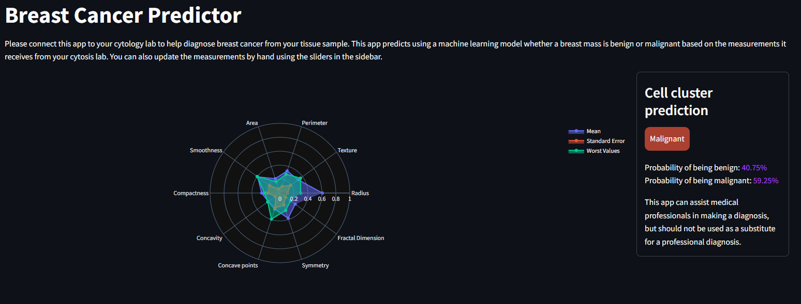

# ML-Cancer-Prediction
This repository contains a web application built with Streamlit for predicting breast cancer using the Breast Cancer Wisconsin (Diagnostic) Data Set. The app leverages machine learning models to classify whether a tumor is benign or malignant.



This app uses a machine learning model to predict whether a breast tumor is benign or malignant. Users can manually adjust cell nucleus values or connect the app to a cytology lab for precise predictions.

## Features
Interactive Visualization: Radar chart to compare mean, standard error, and worst values of cell nuclei features.
Accurate Predictions: Leverages a trained model to classify breast tumors with benign or malignant probabilities.
Customizable Interface: Manually adjust input values using interactive sliders.

## Prerequisites
Before running the app, make sure you have the following installed:
- Python 3.7 or higher
- Streamlit
- Plotly
- Pandas
- Numpy
- Pickle

You can install the necessary dependencies by running:
```bash
pip install -r requirements.txt
```
## How to Run the Application
**1. Clone the repository:**

```bash
git clone https://github.com/yourusername/breast-cancer-predictor.git
cd breast-cancer-predictor
```
**2. Run the application with Streamlit:**
```bash
streamlit run app.py
```
3. Open your browser and navigate to http://localhost:8501 to view the app in action.

## How to Use the Application
Input Data: Use the sliders in the sidebar to adjust cell nucleus feature values.
Prediction: The app predicts whether the tumor is benign or malignant, showing corresponding probabilities.
Interactive Chart: View a visual comparison of the mean, standard error, and worst values using a radar chart.

## Code Explanation
### `get_clean_data()`
Cleans the dataset by removing unnecessary columns and mapping diagnosis (M for malignant and B for benign).

### `add_sidebar()`
Generates interactive sliders that allow users to adjust the input values for cell nucleus features.

### `get_scaled_values()`
Scales input values to ensure all are between 0 and 1 for better machine learning model performance.

### `get_radar_chart()`
Creates a radar chart using Plotly, displaying three sets of values: mean, standard error, and worst values.

### `add_predictions()`
Loads the model and scaler, makes predictions based on user inputs, and displays whether the tumor is benign or malignant, along with the corresponding probabilities.

### `main()`
The main function that configures the Streamlit app, organizes the layout, and calls the previous functions to generate the full interface.


### Important Notes
This app is designed to assist medical professionals in decision-making but should not be used as a substitute for a professional medical diagnosis.

